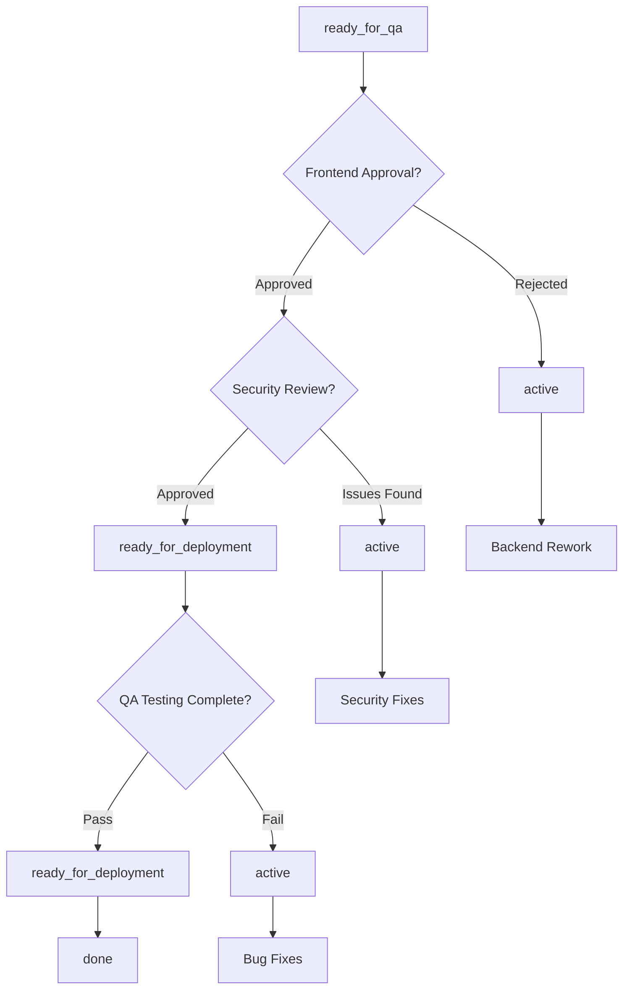

# Issue: Cross-Team Workflow Example

## Description
This issue demonstrates a complex cross-team workflow involving backend development, frontend integration, security review, and QA coordination. It showcases how the unified state management system supports multi-team collaboration with proper approval gates.

## Cross-Team State Transition History

### Backend Development Phase
- **2025-07-12T09:00:00Z**: Created in `planning` state by product-manager
  - Reason: Feature prioritized in sprint planning
  - Initial assignment: backend-team
  
- **2025-07-12T14:30:00Z**: Transitioned to `active` by backend-team-lead
  - Reason: Backend team started API implementation
  - Sprint commitment made
  
### Integration Handoff Phase  
- **2025-07-14T15:45:00Z**: Transitioned to `ready_for_qa` by backend-team-lead
  - Reason: Backend implementation complete, needs frontend integration review
  - **Requires Approval**: frontend-team-lead must review API design
  - **Cross-team coordination**: API contract review scheduled
  - **Not automation eligible**: Requires human design review

## Multi-Team Collaboration Workflow

### Team Responsibilities
| Team | Phase | Responsibilities | Approval Authority |
|------|-------|------------------|-------------------|
| **Product** | Planning | Requirements, priorities | Initial approval |
| **Backend** | Development | API implementation, documentation | Technical design |
| **Frontend** | Integration | UI implementation, UX review | API contract approval |
| **Security** | Review | Security audit, compliance | Security clearance |
| **QA** | Testing | Test planning, execution | Quality gates |
| **DevOps** | Deployment | Infrastructure, monitoring | Production readiness |

### Current State: Ready for QA (Pending Frontend Review)

#### Required Approvals Before Next Transition
1. **Frontend Team Lead Review** (Pending) 🔄
   - API contract compatibility
   - Frontend integration feasibility
   - UX impact assessment
   - Timeline coordination

2. **Security Team Review** (Scheduled)
   - API security assessment
   - Data flow analysis
   - Authentication/authorization review

3. **QA Team Planning** (Waiting for approvals)
   - Test case design
   - Cross-team testing coordination
   - Performance testing requirements

## Approval Workflow Configuration

### Frontend Review Requirements
```yaml
approval_gate_1:
  reviewer: frontend-team-lead
  type: design_review
  deadline: "2025-07-16T17:00:00Z"
  requirements:
    - API contract review
    - Frontend feasibility assessment
    - Integration timeline estimate
    - Resource allocation confirmation
  bypass_conditions:
    - emergency_deployment: false
    - security_exception: false
```

### Security Review Gate
```yaml
approval_gate_2:
  reviewer: security-team
  type: security_review
  auto_schedule: true
  requirements:
    - API security assessment
    - Data classification review
    - Compliance check (GDPR, SOX)
    - Vulnerability assessment
  blocking_conditions:
    - high_severity_vulnerabilities: true
    - compliance_violations: true
```

## Cross-Team Integration Points

### API Contract Coordination
```yaml
# Backend deliverables for frontend review
backend_deliverables:
  - api_specification: "/docs/api/user-management-v2.yaml"
  - authentication_flow: "/docs/auth/oauth-flow.md"
  - error_handling: "/docs/api/error-codes.md"
  - rate_limiting: "/docs/api/rate-limits.md"
  - test_environment: "https://api-staging.company.com"

# Frontend integration requirements
frontend_requirements:
  - typescript_definitions: true
  - mock_data_available: true
  - error_boundary_patterns: true
  - loading_state_handling: true
  - responsive_design_compliance: true
```

### Test Coordination Matrix
| Test Type | Backend Owner | Frontend Owner | QA Owner | Timeline |
|-----------|---------------|----------------|----------|----------|
| Unit Tests | ✅ Complete | 🔄 In Progress | ⚡ Review | 2 days |
| API Tests | ✅ Complete | N/A | ✅ Complete | Complete |
| Integration | 🔄 Pending | 🔄 Pending | 📅 Scheduled | 3 days |
| E2E Tests | N/A | 🔄 Pending | 📅 Scheduled | 4 days |
| Performance | ✅ Complete | 🔄 Pending | 📅 Scheduled | 5 days |

## State Transition Decision Tree



## Next Steps by Team

### Frontend Team (Current Blockers)
- [ ] **Review API specification** (Due: 2025-07-16)
- [ ] **Assess integration complexity** 
- [ ] **Provide timeline estimate**
- [ ] **Approve or request changes**

### Backend Team (Supporting)
- [x] **API implementation complete**
- [x] **Documentation provided**
- [ ] **Address frontend feedback** (If any)
- [ ] **Support integration questions**

### Security Team (Scheduled)
- [ ] **Schedule security review** (After frontend approval)
- [ ] **Conduct API security assessment**
- [ ] **Review authentication flows**
- [ ] **Provide security clearance**

### QA Team (Preparing)
- [ ] **Design cross-team test scenarios**
- [ ] **Setup integration test environment**
- [ ] **Coordinate testing timeline**
- [ ] **Prepare performance benchmarks**

## Escalation Procedures

### Approval Timeouts
```yaml
escalation_rules:
  frontend_review_timeout:
    deadline: "2025-07-16T17:00:00Z"
    escalate_to: "engineering-director"
    action: "schedule_review_meeting"
    
  security_review_delay:
    threshold: "3_business_days"
    escalate_to: "security-manager"
    action: "prioritize_review"
    
  cross_team_conflict:
    trigger: "approval_rejection"
    escalate_to: "product-manager"
    action: "schedule_alignment_meeting"
```

### Conflict Resolution
If frontend team rejects the API design:
1. **Automatic transition** back to `active` state
2. **Backend team notification** with feedback details
3. **Meeting scheduling** for alignment discussion
4. **Product manager involvement** for priority decisions

## Communication Plan

### Status Updates
- **Daily standups**: Cross-team coordination updates
- **Slack notifications**: Automatic state transition alerts
- **Email summaries**: Weekly cross-team progress reports
- **Dashboard visibility**: Real-time workflow status

### Notification Configuration
```yaml
notifications:
  state_transitions:
    - channel: "#team-backend"
      events: ["transitioned_from_active"]
    - channel: "#team-frontend" 
      events: ["requires_approval", "transitioned_to_ready_for_qa"]
    - channel: "#team-security"
      events: ["security_review_required"]
    - channel: "#team-qa"
      events: ["ready_for_testing"]
      
  approval_requests:
    - email: "frontend-lead@company.com"
      template: "approval_request"
    - slack: "@frontend-team-lead"
      urgency: "high"
```

## Success Metrics

### Collaboration Effectiveness
- **Approval Response Time**: Target < 2 business days
- **Cross-team Communication**: Tracked via state metadata
- **Rework Cycles**: Minimize through better upfront coordination
- **Timeline Adherence**: Meet original sprint commitments

### Current Status
- **Backend Delivery**: ✅ On time
- **Frontend Review**: 🔄 In progress (1 day remaining)
- **Security Review**: 📅 Scheduled
- **Overall Timeline**: 🟡 At risk (depends on approvals)

## Notes
This issue demonstrates how the unified state management system supports complex cross-team workflows with proper approval gates, clear accountability, and comprehensive audit trails. The rich metadata enables effective coordination across teams while maintaining visibility into blockers and dependencies.

The workflow showcases:
- **Multi-team coordination** with clear handoffs
- **Approval workflows** with timeout and escalation
- **Cross-functional collaboration** patterns
- **Conflict resolution** procedures
- **Communication automation** for status updates